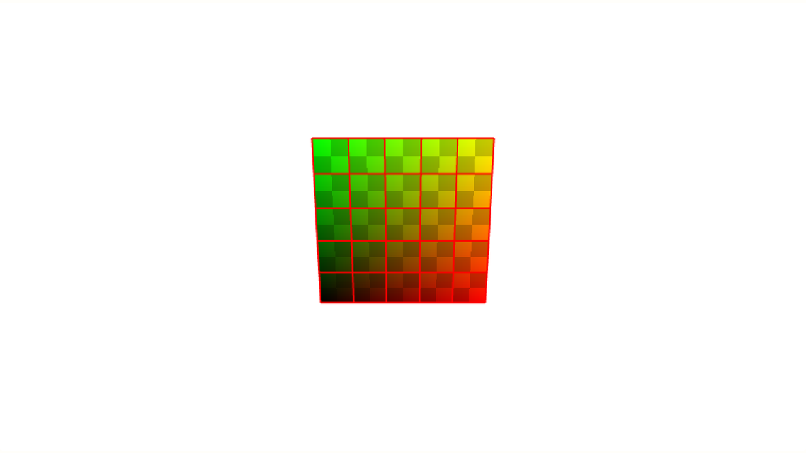

# primitive-plane

[](http://github.com/badges/stability-badges)

Plane geometry including UVs and normals

## Usage

[](https://www.npmjs.com/package/primitive-plane)

#### `mesh = createPlane([sx, sy, nx, ny, options])`

Parameters:  
`sx` - size x, defaults to 1  
`sy` - size y, defaults to `sx`  
`nx` - num x subdivisions, defaults to 1  
`ny` - num y subdivisions, defaults to 1  
`options` - { quads: bool }  
`options.quads` - generates quads instead of triangles, defaults to false

## Example

```javascript
var createPlane = require('primtivie-plane');
var plane = createPlane(1, 1, 2, 2, { quads: true });
```

`plane` will have the following structure:

```
{
  positions: [ [x, y, z], [x, y, z], ... ],
  cells: [ [a, b, c], [a, b, c], ... ],
  uvs: [ [u, v], [u, v], ... ],
  normals: [ [x, y, z], [x, y, z], ... ]
}
```

## Demo

Download or clone this repo and run:

```
cd demo
npm install
npm start
```


## License

MIT, see [LICENSE.md](http://github.com/vorg/primitive-plane/blob/master/LICENSE.md) for details.
